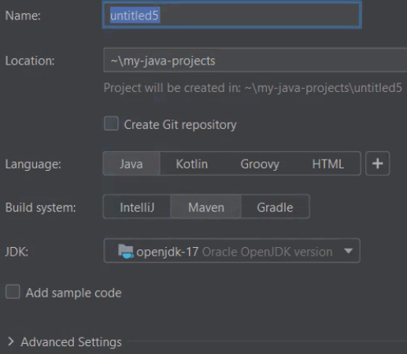

# Git Assignments

# Ex. 1 Clone & Push
- Generate SSH keys
- Clone this repo
- Update the main class with your name & favorite food
- Push your branch to the repo

# Ex. 2 Create Java Project & Push to Your Repo
This assignment involves creating a new Java/Maven project and pushing it to a Git repository in your 
Github account.

#### GitHub
- Create new public repo in your GitHub account:
    - Upper right corner >> Click "+" >> New Repository >> {name}
    - Make sure it's public
    - Click Create Repository
    - Copy the SSH url, for example: `git@github.com:{your github handle}/{name}.git`

#### IntelliJ
- Create a new Maven project with IntelliJ
    - Upper Right >> New Project
    - Make sure you select Maven build as the build system:

    

    - Left Menu >> select Maven >> Next
    - Enter a name
    - Create a new directory, something like `C:\my-java-projects\test`

  

  - Click Finish
  - Wait a bit for maven to initialize the project
  - The java folder should be a light blue color, different from the rest of the folders
  - Right click on the java folder (`/src/main/java`):
  - New >> Java Class
      - Specify a class name, something like: `Main`
      - Type `main` >> press tab
      - Type `sout` >> press tab
      - Provide a string to the `println()` function


- Click on the Green arrow and run the Java program (`Run 'Main.main()'`).
- If it works, let's push it to GitHub!

#### Add Git Ingore File
Create a file called `.gitignore` and above the `pom.xml` file.  Add the following contents to this file:

```
# Default ignored files
/shelf/
/workspace.xml

# Compiled
*.class
target/**

# Mobile Tools for Java (J2ME)
.mtj.tmp/

# Package Files #
*.jar
*.war
*.ear

# IntelliJ project files
.idea/misc.xml
**/*.iml
.idea/**
.idea
*.iml
out
gen

# virtual machine crash logs, see http://www.java.com/en/download/help/error_hotspot.xml
hs_err_pid*

# Database
application.properties
```
ProTip: Add this as a "live template" (code snippet) in IntelliJ: File >> Settings >> Search >> Live Templates.

#### Connect Code with GitHub
- Open the Terminal window in IntelliJ (bottom tab)
- `git init`
- `git remote add origin {paste ssh url from above}`
- `git add --all`
- `git commit -m "Initial commit."`
- `git push origin main` or `git push origin master`

ProTip: Change your default shell to `cmd.exe` so you can chain all the Git commands together:

`git add --all && git commit -m "Initial commit." && git push origin main`

Refresh your browser.  GitHub should resemble something like this:


#### Add Readme File
- Add a `readme.md` file in IntelliJ:
    - Right click `pom.xml` >> New >> File
    - Add some [Markdown](https://www.markdownguide.org/basic-syntax/) text to the readme.md file
    - Save it
    - `git add --all`
    - `git commit -m "Add readme.`
    - `git push origin main` or `git push origin master`

ProTip: Open a Terminal window as a Command Prompt so we can chain Git commands together:


`git add --all && git commit -m "Add readme." && git push origin main`
