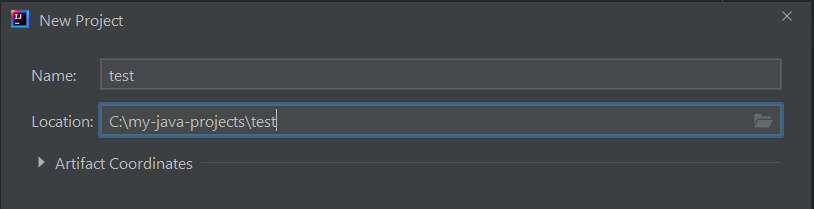
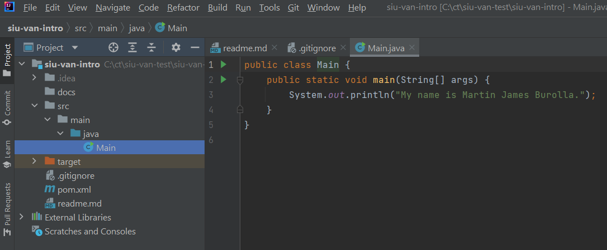
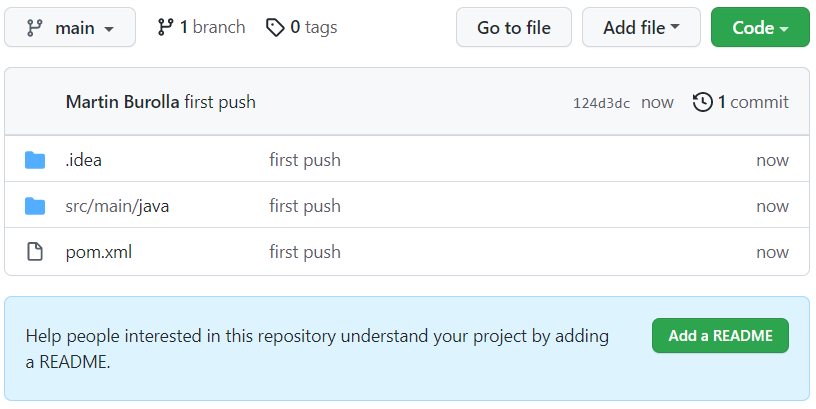
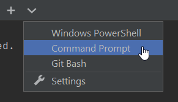

# SIU Java Intro
A simple repo to help students get used to Git. 

# Updating Code & Pushing to GitHub
- Identify the branch you are on: `git branch`
- Create a branch from the branch you are currently on: `git checkout -b dev-{initials}-{context}`
- To see what has changed: `git status`
- PROTIP: ALWAYS run `git status` before you make a commit
- To stage ALL files: `git add --all`
- To create a commit: `git commit -m "YOUR_MESSAGE_HERE"`
- To push to GitHub: `git push origin YOUR_BRANCH_NAME`

# Common Git Commands
```
git init
git clone <url>
git fetch --all
git push origin <branch name>
git pull origin <branch name>
git remote add origin <url>
git add --all
git branch
git checkout -b <new branch name>
git checkout
git commit -m “your message”
git status
git reset --hard
git clean -f
```

# Assignment 

#### GitHub
- Create new public repo in your GitHub account:
  - Upper right corner >> Click "+" >> New Repository >> {name}
  - Make sure it's public
  - Click Create Repository
  - Copy the SSH url, for example: `git@github.com:{your github handle}/{name}.git`

#### IntelliJ
- Create a new Maven project with IntelliJ 
  - Upper Right >> New Project
  - Left Menu >> select Maven >> Next
  - Enter a name
  - Create a new directory, something like `C:\my-java-projects\test`

  

  - Click Finish
  - Wait a bit for maven to initialize the project 
  - The java folder should be a light blue color, different from the rest of the folders
  - Right click on the java folder (`/src/main/java`):
  - New >> Java Class
    - Specify a class name, something like: `Main`
    - Type `main` >> press tab
    - Type `sout` >> press tab
    - Provide a string to the `println()` function
    


  - Click on the Green arrow and run the Java program (`Run 'Main.main()'`).
  - If it works, let's push it to GitHub!
  
#### Add Git Ingore File
Create a file called `.gitignore` and above the `pom.xml` file.  Add the following contents to this file:

```
# Default ignored files
/shelf/
/workspace.xml

# Compiled
*.class
target/**

# Mobile Tools for Java (J2ME)
.mtj.tmp/

# Package Files #
*.jar
*.war
*.ear

# IntelliJ project files
.idea/misc.xml
**/*.iml
.idea/**
.idea
*.iml
out
gen

# virtual machine crash logs, see http://www.java.com/en/download/help/error_hotspot.xml
hs_err_pid*

# Database
application.properties
```

#### Connect Code with GitHub
- Open the Terminal window in IntelliJ (bottom tab)
- `git init`
- `git remote add origin {paste ssh url from above}`
- `git add --all`
- `git commit -m "First push."`
- `git push origin main`


Refresh your browser.  GitHub should resemble something like this:


 

#### Add Readme File
- Add a `readme.md` file in IntelliJ:
  - Right click `pom.xml` >> New >> File
  - Add some [Markdown](https://www.markdownguide.org/basic-syntax/) text to the readme.md file
  - Save it
  - `git add --all`
  - `git commit -m "Add readme.`
  - `git push origin main`

ProTip: Open a Terminal window as a Command Prompt so we can change Git commands together:



`git add --all && git commit -m "Add readme." && git push origin main`

